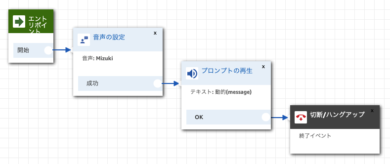

# aws-lambda-amazon-connect

## 概要

CloudWatchで検知したエラーをAmazon Connectの問い合わせフローで通知します。

1. Lambda関数でエラーが発生
2. CloudWatchでエラーを検知
3. CloudWatchAlarmでSNSに通知
4. SNSがLambda関数を実行
5. Lambdaが関数Amazon Connectの問い合わせフローを実行

## コールセンター構築

Amazon ConnectはCloudForamtionに対応していないため、コールセンターの構築は手動で実施する必要があります。以下の手順を参考にしてください。

1. [Amazon Connectのコンソール](https://ap-northeast-1.console.aws.amazon.com/connect/home?region=ap-northeast-1#)へ移動
2. インスタンスを作成
3. 電話番号を取得
4. 問い合わせフローを作成

### インスタンス作成

* Amazon Connect 内にユーザーを保存を選択
* アクセスURLに一意のディレクトリ名を入力
* テレフォニーオプションは発信のみチェック
* データストレージはデフォルトでOK

### 電話番号取得

* Amazon Connect > 電話番号の管理 > 電話番号の取得
* DID（直通ダイヤル）、日本を選択
* 候補から電話番号を選択

### 問い合わせフロー作成

* Amazon Connect > 問い合わせフロー > 問い合わせフローの作成
* 下の図を参考に問い合わせフローを作成（保存と公開）
* プロントの再生には「テキスト読み上げ機能」「動的に入力する」を選択
* タイプには「ユーザー定義」、属性には「message」、解釈には「テキスト」を設定



追加フロー情報からARNを取得できます。また、ARNから「インスタンスID」と「コンタクトフローID」を取得します。

```
arn:aws:connect:{AWS::Region}:{AWS::AccountId}:instance/{インスタンスID}/contact-flow/{コンタクトフローID}
```

## デプロイ

### 環境変数設定

デプロイで利用する環境変数を設定します。

```
export PROJECT_NAME='' # 一意なプロジェクト名
export DESTINATION_PHONE_NUMBER='+819000000000' 通知先の電話番号
export SOURCE_PHONE_NUMBER='+815000000000' # 取得した電話番号
export INSTANCE_ID='' # 取得したインスタンスID
export CONTACT_FLOW_ID='' # 取得したコンタクトフローID
```

※電話番号の先頭に国番号を入れます。日本の場合は「+81」です。
※電話番号が「0」から始める場合は、先頭の「0」を省略します。
※電話番号にハイフンは必要ありません。

### S3バケット作成

アーティファクト用のS3バケットを作成します。

```
aws s3api create-bucket --bucket ${PROJECT_NAME}-artifact --region ap-northeast-1 --create-bucket-configuration LocationConstraint=ap-northeast-1
```

### CloudFormation

パッケージ化

Lambda関数のコードをS3バケットにアップロードします。

```
aws cloudformation package \
    --template-file template.yaml \
    --output-template-file template-output.yaml \
    --s3-bucket ${PROJECT_NAME}-artifact
```

AWSのリソースをデプロイします。

```
aws cloudformation deploy \
    --template-file template-output.yaml \
    --stack-name ${PROJECT_NAME}-stack \
    --parameter-overrides ProjectName=${PROJECT_NAME} DestinationPhoneNumber=${DESTINATION_PHONE_NUMBER} SourcePhoneNumber=${SOURCE_PHONE_NUMBER} InstanceId=${INSTANCE_ID} ContactFlowId=${CONTACT_FLOW_ID} \
    --no-fail-on-empty-changeset \
    --capabilities CAPABILITY_NAMED_IAM
```

## 実行

Lambda関数を実行して意図的にエラーを発生させます。

```
aws lambda invoke log \
    --invocation-type Event \
    --function-name ${PROJECT_NAME}-run-error \
    --region ap-northeast-1 \
    --payload '{}'
```

通知のみ実行する場合は次のようにします。

```
aws lambda invoke log \
    --invocation-type Event \
    --function-name ${PROJECT_NAME}-call-error-message \
    --region ap-northeast-1 \
    --payload '{"Records": [{"Sns": {"Message": "{\"AWSAccountId\": \"12345\"}"}}]}'
```

## リソース削除

リソースを削除します。

```
aws s3 rm s3://${PROJECT_NAME}-artifact --recursive
aws cloudformation delete-stack --stack-name ${PROJECT_NAME}-stack
```
